# YegSec CTF 

## USB LUKS Encryption Brute Force Guide

`V1.0 Jan 2019 slack @malikaz | github @malikazz | https://malikaz.com`

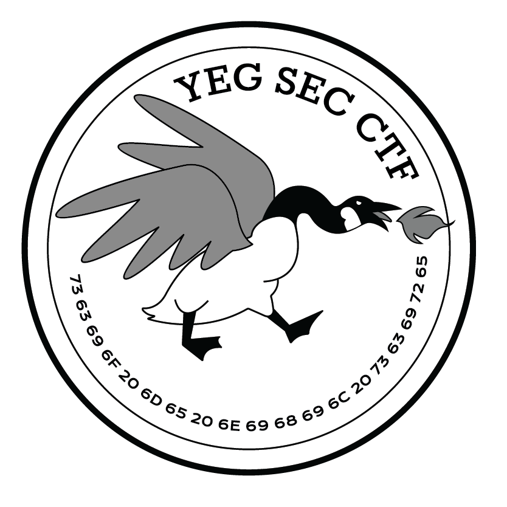

### Table of Contents
- Introduction
- Tools
- Guide
- Extras

# Introduction

This guide was created by Malikaz from YegSecCTF @malikaz in slack. It serves as a quick guide on brute forcing LUKS / LUKS.2 encryption which is a common drive encryption method on the Linux operating system.  This guide assumes you have a hard drive or usb flash drive with an encrypted portion.

# Tools / Libraries

You will require 
- lsblk
- fdisk
- dd
- Hashcat ( I am using 4.x but any version with supports LUKS should work )
- cryptsetup-bin

# Guide
## Identify if the encryption is LUKS

Plug in your USB or harddrive and use `lsblk` to find the drive name.

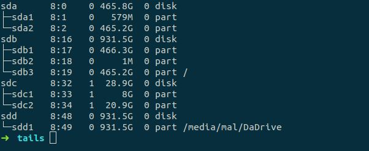

The drive I am using has tails installed with an encrypted persitant volume. You will notice sdc is the small USB we are looking for. Their are 2 partitions on the drive and we need to identify what they are. In this case you can use `fdisk -l` on the drive to get a more detailed read out. 

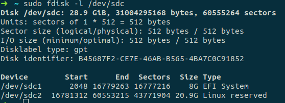

The 8G section is the boot and operating system which is not encrypted. The 20.9G section is the space left for the persistent encrypted drive on tails. To find out what kinda of encryption we are dealing with for sure we can check the header of the file. We will grab the first 4097 bytes and look there. 

We can use dd to do this with a command like so `dd if=/dev/sdc2 of=header_file.001 bs=512 count=4097` 

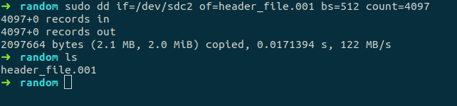

If we take a look at the file with vim or a hexdumb you should hopefully see a LUKS header. 

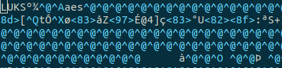

Ok so we now know this file is using a LUKS encryption for sure. We can proceed with the cracking part.

Hashcat is alot of program so I will explain a few options now before giving them command. 

| options | name | discription |
|---------|------|-------------|
| -m | Hash method | what type of file we are dealing with |
| -a | Crack method | what type of attack we will be doing |
| -w | Resource allocation | how much cpu / gpu to use |
| -o | Output file | name and location of output file |

In our run we will be using -m 14600 which is the LUKS option, -a 0 which tells hashcat to use a dictionary to attack with, -w 3 for high resource useage. `rockyou.txt is the dictionary`. 

`hashcat -m 14600 -a 0 -w 3 header_file.001 rockyou.txt -o password.txt`

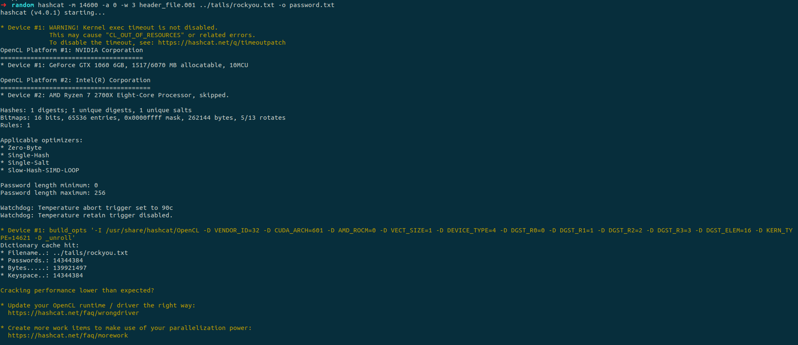

After a short wait 

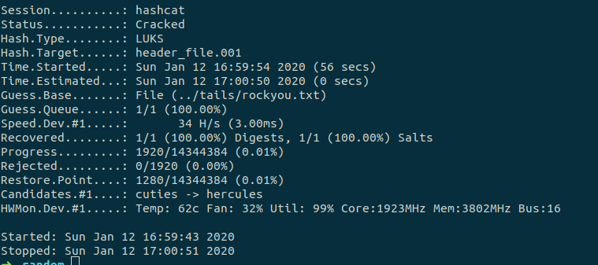

File contents of password.txt

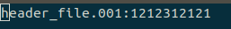

Try entering said password to decrypt the password using cryptsetup

`sudo cryptsetup luksopen toCrack.img Decrypted_partition`

toCrack.img was made using dd and copying the entire /dev/sdc2 area.

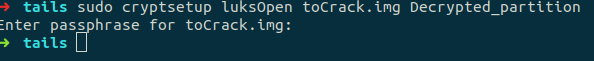

`lsblk` to see new volume 

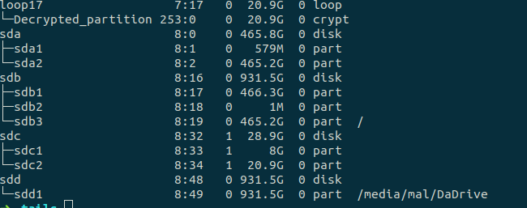

Contains persistent tails volume woo

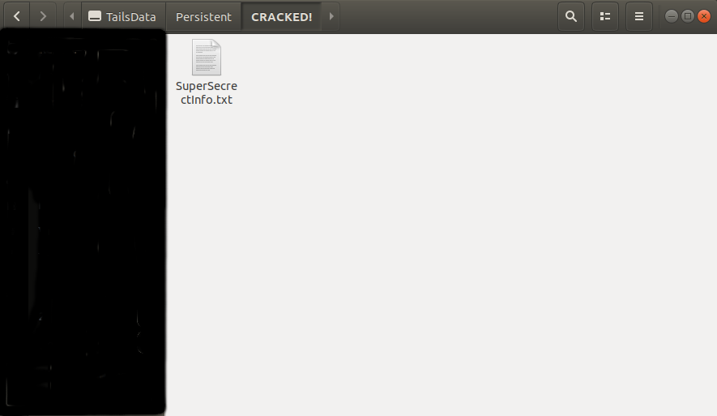
